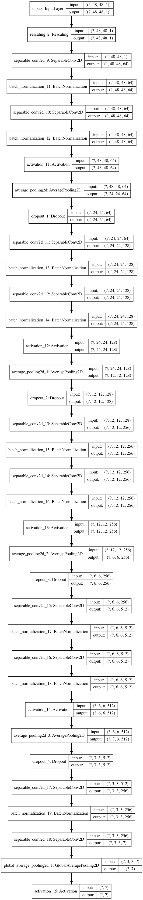

# FER 2013

https://www.kaggle.com/c/challenges-in-representation-learning-facial-expression-recognition-challenge

Data Download: https://www.kaggle.com/c/3364/download-all

## Train

```bash
python3 model_train.py 64 200
```

## Local Demo

```bash
python3 ./demo.py
```

## TensorFlow Serving Demo with Docker

```bash
python3 ./h5_2_tf.py
```

```bash
bash ./tf_serving_docker.sh
```

```bash
python3 ./demo_tf_serving.py
```

## Model Structure


